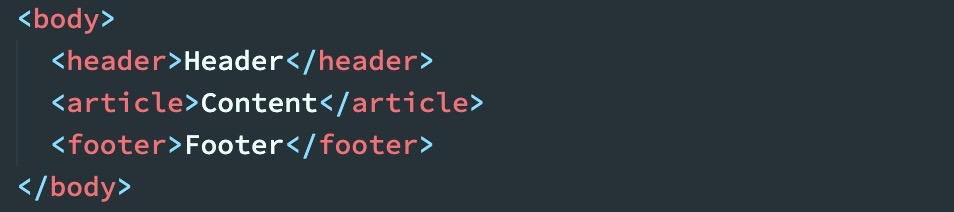
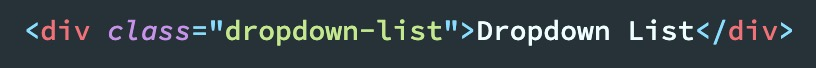
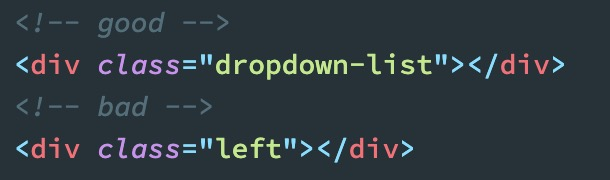
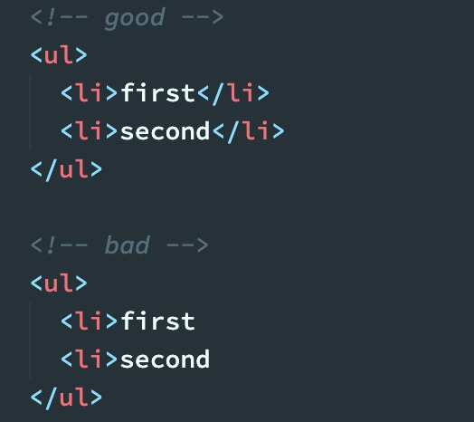
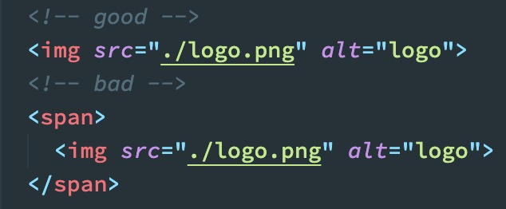
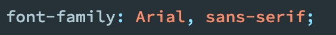
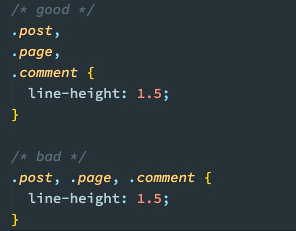
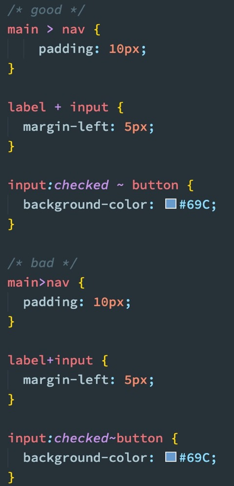
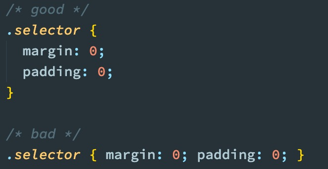
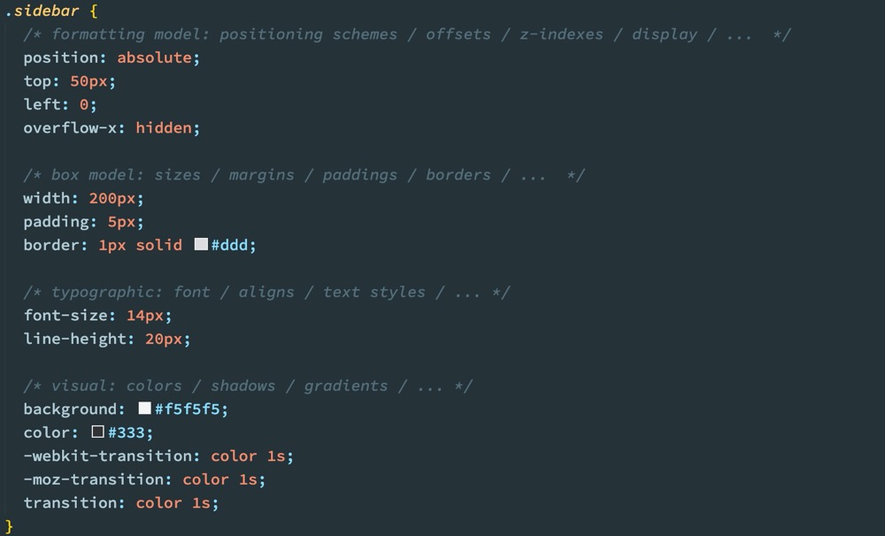

## HTML - CSS 编码规范

### 一、HTML

#### 1、代码风格

- 缩进与换行

  - 使用 `2` 个空格做为一个缩进层级，不允许使用 `4` 个空格 或 `tab` 字符；

    

  - 每行不得超过 `120` 个字符：过长的代码不容易阅读与维护。

  - 但是考虑到 `HTML` 的特殊性，所以不做硬性要求。

- 命名

  - `class`、`id` 必须全字母小写，单词间以 `-` 分隔

    

  - `class` 必须代表相应模块或组件的内容或功能，不得以样式信息进行命名；

    

- 元素 id 必须保证页面唯一

- 同一页面，应避免使用相同的 `name` 和 `id`
  - IE 浏览器会混淆元素的 `id` 和 `name` 属性， `document.getElementById` 可能获得不期望的元素。所以在对元素的 `id` 与 `name` 属性的命名需要非常小心。一个比较好的实践是，为 `id` 和 `name` 使用不同的命名法。
- 在可以保证描述清楚的前提下，命名长度尽可能短

#### 2、标签

- 标签名必须使用小写字母；      

- 对 `HTML5` 中规定允许省略的闭合标签，不允许省略闭合标签；

  

- 标签使用必须符合标签嵌套规则；

  - `tbody` 必须置于 `table` 中
  - `div` 不要嵌套在 `p` 中 `HTML` 

- 标签的使用应该遵循标签的语义；

  - `p` 段落
  - `h1`、`h2`、`h3` … 层级标题

- 标签的使用应尽量简洁，减少不必要的标签，避免标签嵌套太深；

  

- `img` 标签要写 `alt` 属性

  - `alt` 属性的属性值是在图片无法加载时显示的文字；
  - 根据图片想要表达的意思，填充 `alt` 属性；
  - 填充 `alt` 属性有利于`SEO`。

### 二、CSS

#### 1、代码风格

- 缩进与换行

  - 使用 `2` 个空格做为一个缩进层级，不允许使用 `4` 个空格 或 `tab` 字符；

  - **选择器** 与 `{` 之间必须包含空格；

  - **属性名** 与之后的 `:` 之间不允许包含空格， `:` 与 **属性值** 之间必须包含空格；

  - **列表型属性值** 书写在单行时，**,** 后必须跟一个空格；

    

  - 每行不得超过 `120` 个字符，除非单行不可分割；

#### 2、选择器

- 当一个 `rule` 包含多个 `selector` 时，每个选择器声明必须独占一行；

  

- `>`、`+`、`~` 选择器的两边各保留一个空格；

  

- 选择器的嵌套层级应不大于 `3` 级，位置靠后的限定条件应尽可能精确；

#### 3、属性

- 属性定义必须另起一行；

  

- 属性定义后必须以分号结尾，不要省掉分号；

- 同一 rule set 下的属性在书写时，应按功能进行分组，并以 `Formatting Model`（布局方式、位置） > `Box Model`（尺寸） > `Typographic`（文本相关） > `Visual`（视觉效果） 的顺序书写，以提高代码的可读性；

  

#### 4、值与单位

-  长度为 `0` 时需省略单位
- 文本内容必须用双引号包围
- 颜色值中的英文字符采用小写，如不用小写也需要保证同一项目内保持大小写一致